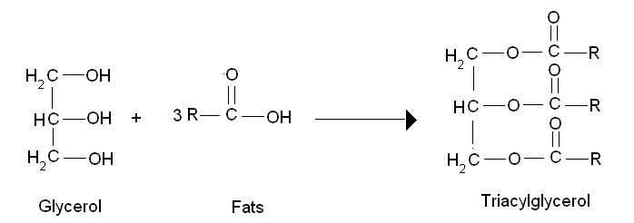
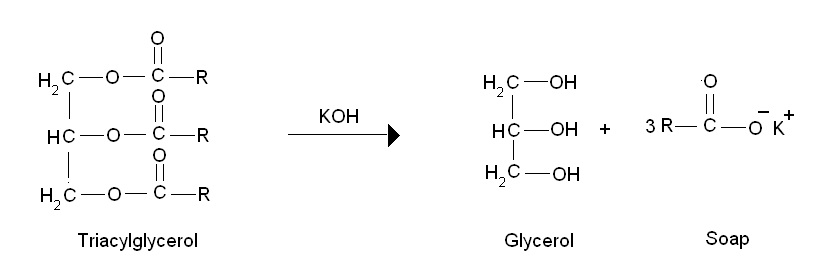

### Theory:
 
Fats and oils are the principle  stored forms of energy in many organisms. They  are highly reduced compounds and are derivatives of fatty acids.  Fatty acids are carboxylic acids with hydrocarbon chains of 4 to 36 carbons,  they can be saturated or unsaturated.  The simplest lipids constructed from fatty acids are  triacylglycerols or triglycerides.  Triacylglycerols are composed of three fatty acids each in ester linkage with a single glycerol.  Since the polar hydroxyls of glycerol and the polar carboxylates of the fatty acids are bound in ester linkages, triacyl glycerols are non polar, hydrophobic molecules, which are insoluble in water.

&nbsp;

 

Saponification is the hydrolysis of fats or oils under basic conditions to afford glycerol and the salt of the corresponding fatty acid.   Saponification literally means "soap making". It  is important to the industrial user to know the amount of free fatty acid present, since this determines in large measure the refining loss. The amount of free fatty acid is estimated by determining the quantity of alkali that must be added to the fat to render it neutral. This is done by warming a known amount of the fat with strong aqueous caustic soda solution, which converts the free fatty acid into soap.  This soap is then removed and the amount of fat remaining is then determined. The loss is estimated by subtracting this amount from the amount of fat originally taken for the test.

 

&nbsp;

The saponification number is the number of milligrams of potassium hydroxide  required to neutralize the fatty acids  resulting from the complete hydrolysis of 1g of fat .    It gives information concerning the character of the fatty acids of the fat- the longer the carbon chain, the less acid is liberated per gram of fat hydrolysed. It is also considered  as a  measure of the average molecular weight (or chain length) of all the fatty acids present.  The long chain fatty acids found in fats have low saponification value because they have a relatively fewer number of carboxylic functional groups per unit mass of the fat and therefore high molecular weight .

&nbsp;

### Principle:
 

Fats (triglycerides) upon alkaline hydrolysis (either with KOH or NaOH ) yield glycerol and potassium or sodium salts of fatty acids (soap) .  

 